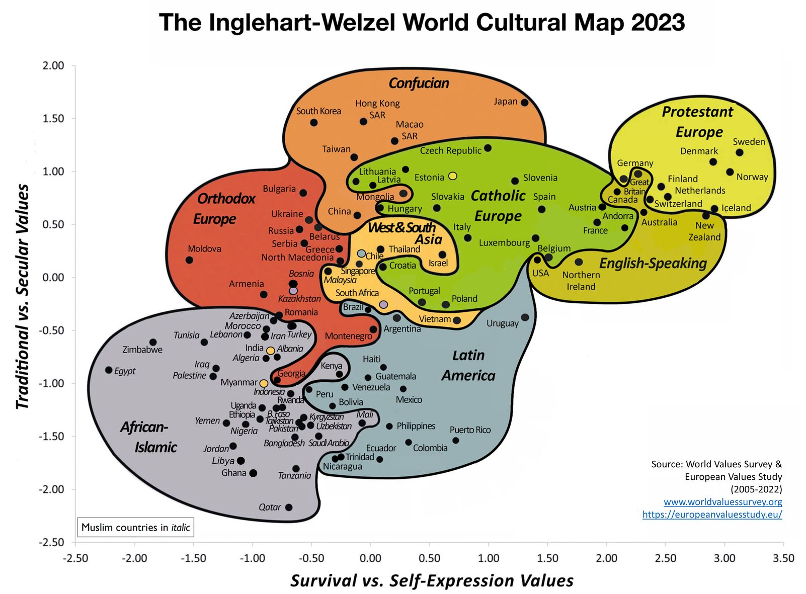

I've found it interesting, how culture impacts social-economic development. 

World Values Survey (WVS) is an international research of people's social, political, economic, religious, and cultural values. 

On the Y-axis, traditional values emphasize religiosity, national pride, respect for authority, obedience, and marriage. Secular-rational values emphasize the opposite on each of these accounts.
On the X-axis, survival values involve a priority of security over liberty, non-acceptance of homosexuality, abstinence from political action, distrust in outsiders, and a weak sense of happiness. Self-expression values imply the opposite on all these accounts. 

Key takeaways: 

- Correlation with Socioeconomic Status: The map suggests a correlation between a society's cultural values and its socioeconomic status, with wealthier countries tending to have higher self-expression values and poorer countries tending to have higher survival values.

- Cultural Shift with Economic Development: As countries develop economically, moving from agrarian to industrial and then post-industrial societies, there is a cultural shift from traditional to secular-rational values and from survival to self-expression values.

- Persistent Cultural Traditions: Despite the globalization trend, long-standing cultural traditions continue to have a significant influence. For instance, religious and colonial histories can create distinct cultural zones, such as Protestant Europe and Latin America, which show consistent cultural characteristics within these groups during the time. 
 
#economics #culture #research 