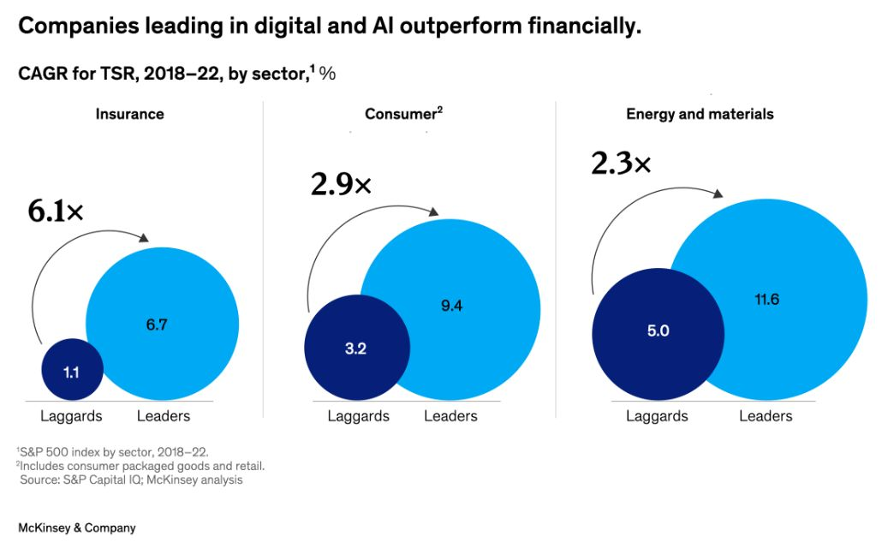

Good to know. However, the direction of causality remains ambiguous. Does the superior performance stem from robust digital and AI investment, or do these companies invest heavily in technology because their financial success provides them with the means to do so? Classic case of the chicken-or-the-egg dilemma. 

